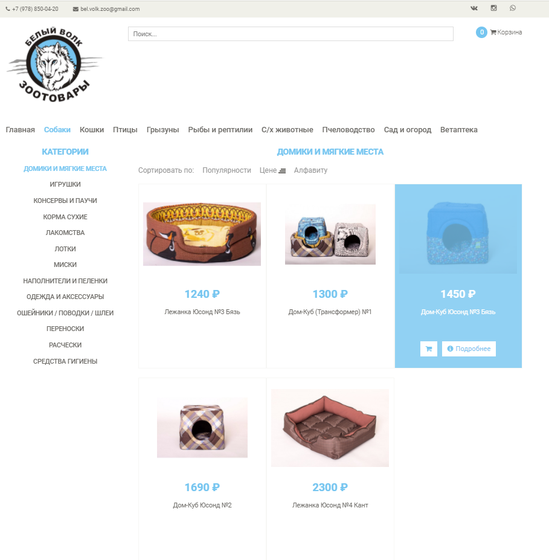
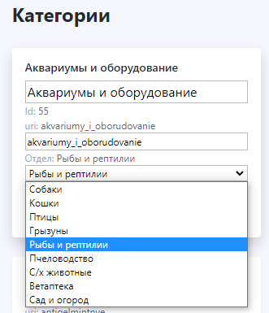

# Online shop
#### Online store with a full admin panel, categories, promo codes, mail notifications
****
## Dependencies:
1. [Docker](https://www.docker.com/)
1. [docker-compose](https://github.com/docker/compose)
1. DNS [Cloudflare](https://www.cloudflare.com/)
## Launch:
1. In the file [.env](.env) write your domain to the DOMAIN variable
1. `chmod +x run.sh` Grant rights to execute the script
1. `./run.sh` Run the project
****
## Additional:
To restart the project and get new updates, write `./restart.sh`.  
The parser will check the sites for new articles every 10 minutes, after checking they will immediately be displayed on the site.
## User Website
#### Index page

#### Category page

#### Product page

#### Cart page

#### User order mail

## Admin Website
#### Products page

#### Categories page

#### Change category

#### Admin order mail

